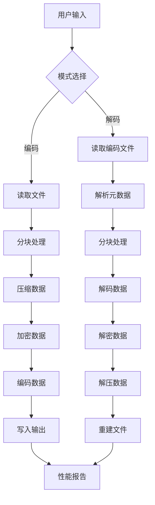

# File2File 文件编码/解码工具


File2File 是一个强大的文件编码/解码工具，支持多种编码格式、压缩算法、加密和分卷处理，专为处理大型文件而设计。

## 功能亮点 ✨

- **多种编码格式支持**：Base64、Base32、Base16、Base85、Hex、URL安全Base64
- **多种压缩算法**：Zlib、Gzip、LZMA、BZ2
- **文件加密**：使用AES-256加密保护敏感文件
- **大文件处理**：智能分块处理，支持超大文件（TB级）
- **分卷处理**：将大文件分割为多个小文件便于传输
- **资源优化**：自动调整内存使用，支持安全模式
- **并行处理**：多线程加速处理过程
- **详细日志**：实时进度显示和性能报告
- **双模式操作**：命令行界面(CLI)和图形用户界面(GUI)

## 应用场景 🚀

1. **安全传输**：将敏感文件编码为文本格式通过邮件传输
2. **数据存档**：压缩并编码重要文件进行长期存储
3. **文件分割**：将大文件分割为小文件便于上传到云存储
4. **跨平台传输**：在不同系统间安全传输二进制文件
5. **嵌入式系统**：将二进制资源转换为可直接嵌入的文本格式

## 安装与使用

### 安装依赖
```bash
pip install -r requirements.txt
```
## 命令行使用 (CLI)
```bash
# 编码文件
python F2F.py encode input_file -e base85 -z lzma -v 100 -p mypassword
```
```bash
# 解码文件
python F2F.py decode encoded_file -o output_file -p mypassword
```

## 图形界面使用 (GUI)
```bash
python F2F_GUI.py
```

## 命令行参数详解

### 编码模式参数
| 参数 | 缩写 | 描述 | 默认值 |
|------|------|------|--------|
| `--input` | `-i` | 输入文件路径 | 必填 |
| `--output` | `-o` | 输出文件路径 | 自动生成 |
| `--encoding` | `-e` | 编码格式 (base64, base32, base16, base85, hex, urlsafe) | base64 |
| `--compression` | `-z` | 压缩算法 (none, zlib, gzip, lzma, bz2) | none |
| `--password` | `-p` | 加密密码 | 无 |
| `--volume` | `-v` | 分卷大小 (MB) | 0 (不分卷) |
| `--safe-mode` |  | 启用内存安全模式 | 关闭 |
| `--direct-io` |  | 使用直接I/O提升性能 | 关闭 |

### 解码模式参数
| 参数 | 缩写 | 描述 | 默认值 |
|------|------|------|--------|
| `--input` | `-i` | 编码文件路径 | 必填 |
| `--output` | `-o` | 输出文件路径 | 自动生成 |
| `--password` | `-p` | 解密密码 | 无 |
| `--safe-mode` |  | 启用内存安全模式 | 关闭 |
| `--direct-io` |  | 使用直接I/O提升性能 | 关闭 |

## 技术架构


## 性能优化 🚀

1. **智能分块**：根据文件大小自动选择最佳块大小
2. **内存映射**：大文件处理使用内存映射技术
3. **并行处理**：多线程加速编码/解码过程
4. **资源监控**：实时监控CPU和内存使用
5. **系统优化**：自动调整系统参数提升性能
6. **安全模式**：限制内存使用防止资源耗尽

## 示例用例

### 案例1：加密并压缩敏感文件
```bash
python F2F.py encode financial_report.xlsx -e base85 -z lzma -p s3cr3tP@ss
```
将生成高度压缩的加密base85文件，可安全通过邮件发送

### 案例2：分割大文件用于云存储
```bash
python F2F.py encode 4k_video.mp4 -v 100
```
将生成多个100MB的分卷文件，便于上传到有大小限制的云存储

### 案例3：嵌入二进制资源到源代码
```bash
python F2F.py encode logo.png -e base64 > logo_base64.txt
```
生成可直接嵌入HTML/CSS/JS的Base64编码

## 贡献指南
欢迎贡献！请遵循以下步骤：

1. **Fork 项目仓库**
2. **创建特性分支**：(git checkout -b feature/AmazingFeature)
3. **提交更改**：(git commit -m 'Add some AmazingFeature')
4. **推送分支**：(git push origin feature/AmazingFeature)
5. **发起 Pull Request**

## 许可证
本项目采用 MIT 许可证 - 详情请参阅 LICENSE 文件

## Future
增加更多的编码格式、优化UI界面，增加更多功能

## 让文件处理更简单、更安全、更高效！ 🚀
